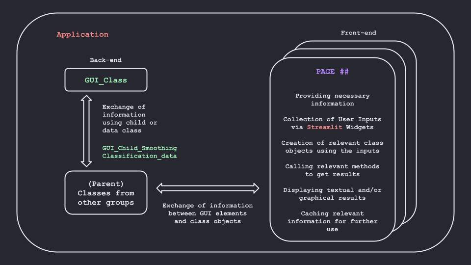

# Graphical User Interface using Streamlit

The Data Science and Visualization Application was developed using the library [**Streamlit**](https://streamlit.io/), which is completely open-source and based on python. The entirely open-source, Python-based library Streamlit was used in the creation of the Data Science and Visualization Application. This makes Streamlit very approachable and relatively simple to understand and use.

The program is set up as a series of separate pages, each of which serves a distinct function. The program uses a variety of concepts, including AI, machine learning, and data processing. The project [**repository**](https://github.com/YuganshuWadhwa/Data-Science-and-Visualization-Application) contains more details on the application and the associated source code. 

 

### Why Streamlit ?
* **Open source** and free to use.
* Completely **based on python**, and hence no prior experience with front-end development is needed.
* Simple, yet **strong API** with vast number of supportive elements for creating **interactive user interfaces**.
* Support for **Github-flavored Markdown**, **LaTeX** expressions and **HTML** tags.
* Adding **widgets** (`st.button`, `st.checkbox`, etc.) to gather user inputs is as simple as declaring variables.
* Functionality to **cache** and **reload** data objects in the current user session.
* Support for **various charting libraries** (`matplotlib.pyplot`, `Bokeh`, `Altair`, `Plotly`, etc.).
* **Easy installation**, **setup** and **running** of the developed applications.

 

### Structure of the Application :
* Developed as a collection of multiple individual **pages**, which can exchange information amongst each other.

* Creation of *(parent)* **classes** from all groups describing the parameters required to run the developed class methods.

* Possible use of **Data classes** (or **Child classes**) for gathering relevant user inputs (datasets, parameters, etc.) and exchanging information amongst the (parent) classes.

* **Each page** describes certain functionality within the application and **works primarily with a certain group of (parent and data) classes**.

* On each page, **Objects** of relevant classes are created and initialized with gathered user-inputs, and relevant class methods are called to generate corresponding **textual** or **visual outputs**.

* The **computed results** are stored back as **class variables**, and are then **displayed on the user interface**.

* Some of the results are also stored in **session cache** for further use in subsequent application pages.

 

### GUI_Class :
Primary class used to store basic information about the selected/uploaded dataset. ([Source Code](https://github.com/YuganshuWadhwa/Data-Science-and-Visualization-Application/blob/master/GUI/GUI_Class.py))

#### Parameters :
* **arg_df** : selected dataframe 
* **arg_filename** : corresponding file name (if present, example *"divorce.csv"*)